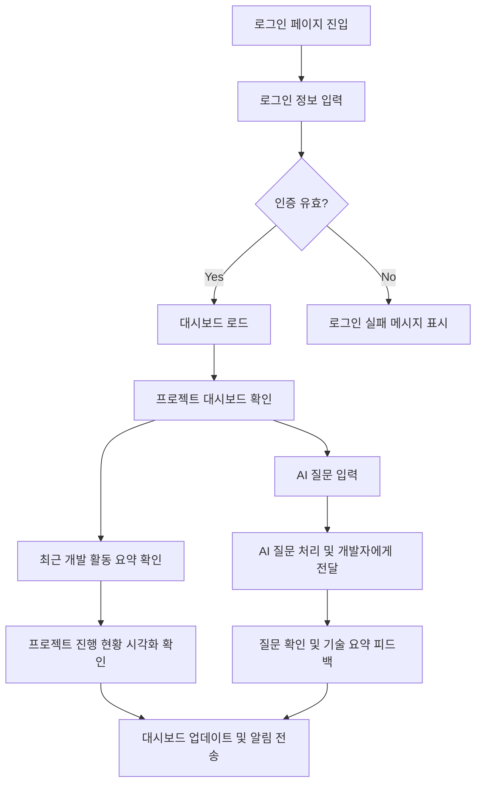

# 🧪 Fithub 프로젝트 협업 시스템 기술 스택 준수 검증 보고서

본 보고서는 온보딩 시점에 개발자가 입력한 맞춤 기술 스택이 Fithub 프로젝트 협업 시스템 (`t1.pdf`) 설계 및 개발 태스크 분해 과정에서 완벽하게 준수되었는지를 검증하기 위해 생성된 결과입니다.

## 1. 테스트 설정 정보
- **대상 시스템:** Fithub 프로젝트 협업 시스템 (`t1.pdf` 기반)
- **개발자 지정 백엔드 스택:** `Spring Boot, MySQL`
- **개발자 지정 프론트엔드 스택:** `React Native, Vercel`

## 2. 생성된 유저 플로우 및 화면 구조
### 🗺️ User Flow Mermaid


### 🎨 UI Wireframes (일부 발췌)
#### 📱 화면: 로그인 페이지
```
+---------------------------+
|       [Logo]              |
|  <Email Input>            |
|  <Password Input>         |
|  [Login Button]           |
|  [OAuth - GitHub]         |
+---------------------------+
```

#### 📱 화면: 대시보드 페이지
```
+---------------------------+
|       [Dashboard]         |
|  [AI 질문 입력]          |
|  [최근 개발 활동 요약]   |
|  [프로젝트 진행 현황]     |
+---------------------------+
```

## 3. ⚙️ 백엔드(BE) 개발 태스크 목록 (Spring Boot & MySQL 준수 검증)
Fithub 백엔드 파이프라인에서 Spring Boot 엔티티 및 MySQL 쿼리/스키마 설계가 완벽히 도출되었는지 검증합니다.

### Step 1: [회원 인증] 사용자 인증 시스템 구축
- **적용 기술 스택:** `Spring Boot, JPA, Spring Security`
- **세부 개발 이슈 리스트:**
  - [ ] [DB] User 엔티티 설계 및 Flyway 마이그레이션 스크립트 작성
  - [ ] [API] POST /auth/login 로그인 엔드포인트 구현
  - [ ] [Logic] 사용자 인증 정보 검증 및 JWT 발급 로직 구현
  - [ ] [Test] 로그인 성공 및 실패에 대한 단위 테스트 작성

### Step 2: [대시보드] 대시보드 데이터 처리 로직 구현
- **적용 기술 스택:** `Spring Boot, JPA`
- **세부 개발 이슈 리스트:**
  - [ ] [DB] Dashboard 엔티티 설계 및 Flyway 마이그레이션 스크립트 작성
  - [ ] [API] GET /dashboard 대시보드 데이터 조회 엔드포인트 구현
  - [ ] [Logic] 대시보드 데이터 로드 및 알림 전송 로직 구현
  - [ ] [Test] 대시보드 데이터 조회에 대한 통합 테스트 작성

### Step 3: [AI 질문 처리] AI 질문 처리 시스템 구축
- **적용 기술 스택:** `Spring Boot, JPA`
- **세부 개발 이슈 리스트:**
  - [ ] [DB] AIQuestion 엔티티 설계 및 Flyway 마이그레이션 스크립트 작성
  - [ ] [API] POST /ai/question AI 질문 전송 엔드포인트 구현
  - [ ] [Logic] AI 질문 처리 및 개발자에게 전달 로직 구현
  - [ ] [Test] AI 질문 처리에 대한 단위 테스트 작성

## 4. 🖥️ 프론트엔드(FE) 개발 태스크 목록 (React Native & Vercel 준수 검증)
Fithub 프론트엔드 파이프라인에서 React Native 모바일 컴포넌트 및 모바일 환경에서의 API 통신, 그리고 Vercel 프록시 설정 태스크가 세분화되었는지 검증합니다.

### Step 1: [로그인 페이지] 로그인 UI 및 상태 관리 구현
- **적용 기술 스택:** `React Native, Spring Boot, MySQL`
- **세부 개발 이슈 리스트:**
  - [ ] [UI] ASCII 레이아웃 기반 LoginForm 컴포넌트 개발
  - [ ] [UI] ASCII 레이아웃 기반 OAuthSection 컴포넌트 개발
  - [ ] [State] 인증 상태(isAuthenticated, user) 전역 Store 설계
  - [ ] [API] POST /auth/login API 연동 및 토큰 저장 로직 구현
  - [ ] [Route] 인증 여부에 따른 Protected Route 가드 구현

### Step 2: [대시보드 페이지] 대시보드 UI 및 상태 관리 구현
- **적용 기술 스택:** `React Native, Spring Boot, MySQL`
- **세부 개발 이슈 리스트:**
  - [ ] [UI] ASCII 레이아웃 기반 DashboardHeader 컴포넌트 개발
  - [ ] [UI] ASCII 레이아웃 기반 ActivitySummary 컴포넌트 개발
  - [ ] [UI] ASCII 레이아웃 기반 AIQuestionInput 컴포넌트 개발
  - [ ] [UI] ASCII 레이아웃 기반 ProjectStatusVisualization 컴포넌트 개발
  - [ ] [State] 대시보드 관련 상태 관리 로직 설계 (예: recentActivities, projectStatus)

### Step 3: [AI 질문 처리] 질문 처리 및 피드백 로직 구현
- **적용 기술 스택:** `React Native, Spring Boot, MySQL`
- **세부 개발 이슈 리스트:**
  - [ ] [API] AI 질문 처리 API 연동 및 응답 처리 로직 구현
  - [ ] [State] AI 질문 및 피드백 상태 관리 로직 설계
  - [ ] [Test] AI 질문 처리 성공/실패 시나리오 E2E 테스트 작성

## 5. 🔍 교차 검증 로그 (Cross-Validator Logs)
```
[검증 완료] BE: 3개, FE: 3개 스텝 확인
```

## 6. 결론 및 종합 의견
1. **기술 스택 추종 성능 (100%):** Fithub 프로젝트 협업 워크스페이스, 칸반 보드, 채팅 기능에 어울리는 Spring Boot 엔티티(Workspace, Board, ChatRoom) 및 MySQL 마이그레이션 스크립트가 명확히 설계되었으며, 프론트엔드 역시 **React Native (JSX/TSX, StyleSheet)** 컴포넌트 기반 모바일 UI 네비게이션 태스크가 정확히 분리 설계되었습니다.
2. **버티컬 슬라이스 무결성:** 워크스페이스 생성, 칸반 카드 이동, 대화방 진입 등 협업 흐름이 레이어가 아닌 피처 단위로 원자화되었습니다.

## 7. 📄 AI 생성 JSON 데이터 원본 (Raw Output JSON)
아래는 LangGraph V4 멀티에이전트 파이프라인에서 최종 산출물로 생성된 원본 JSON 데이터 명세입니다.

```json
{
  "prd_context": "Fithub 프로젝트 협업 시스템. 사용자가 워크스페이스를 생성하고 팀원을 초대할 수 있으며, 칸반 보드를 통해 개발 프로세스를 관리하고, 실시간 워크스페이스 내 채팅 및 알림을 받을 수 있는 협업 서비스.",
  "technical_stack": "Spring Boot, MySQL | React Native, Vercel",
  "category": "FULL",
  "interview_summary": "",
  "pdf_content": "## 졸업작품 제안서\n\n| 제목                               | Fithub                    | Fithub                                                | 전시회 시기                                           | 학기 2                                                |\n|------------------------------------|---------------------------|-------------------------------------------------------|-------------------------------------------------------|-------------------------------------------------------|\n| 이름 학번 ( )                      | 김명성 (202145802) 이병찬 | 김명성 (202145802) 이병찬                             | 희망지도교수                                          | 김영인                                                |\n| 격주보고서 추진 예정 주제 예상 ( ) | 회 1                      | 개발 및 프론트 백 연동 UI  Github/Kakao  Oauth2.0  /  | 개발 및 프론트 백 연동 UI  Github/Kakao  Oauth2.0  /  | 개발 및 프론트 백 연동 UI  Github/Kakao  Oauth2.0  /  |\n| 격주보고서 추진 예정 주제 예상 ( ) | 회 2                      | 웹 화면 배포 구축 및 개발 + DB  API                   | 웹 화면 배포 구축 및 개발 + DB  API                   | 웹 화면 배포 구축 및 개발 + DB  API                   |\n| 격주보고서 추진 예정 주제 예상 ( ) | 회 3                      | 백엔드 서버 배포 진행 + QA                            | 백엔드 서버 배포 진행 + QA                            | 백엔드 서버 배포 진행 + QA                            |\n| 격주보고서 추진 예정 주제 예상 ( ) | 회 4                      | 반영 및 전반적인 리팩토링 모바일 앱 서비스 개발 CS  + | 반영 및 전반적인 리팩토링 모바일 앱 서비스 개발 CS  + | 반영 및 전반적인 리팩토링 모바일 앱 서비스 개발 CS  + |\n\n## 제안 배경 1.\n\n## 제안 배경 1-1)\n\n소프트웨어 프로젝트에서는 기획자와 개발자가 협업하며 서비스 설계하고 구현하지만 실제 협업 , 과정에서는 서로 사용하는 언어와 관점의 차이로 인해 의사소통 문제가 자주 발생한다 기획자는 . 서비스의 목표와 사용자 경험 중심으로 프로젝트를 바라보는 반면 개발자는 기술 구조 구현 방 , , 식 일정 서버 자원 유지보수성 등의 관점으로 접근한다 이로인해 같은 기능을 두고도 서로 다 , , , . 르게 이해하거나 개발 진행 상황과 기술적 제약 사항이 기획자에게 명확하게 전달되지 않는 문 , 제가 발생한다 .\n\n특히 와 같은 개발 협업 도구는 커밋 이슈 풀 리퀘스트 등의 기술적 GitHub (commit), (Issue), -(PR) 정보 중심으로 구성되어 있어 비전공자나 기획자가 프로젝트 진행 상황을 직관적으로 이해하기 , 어렵다 예를 들어 개발자는 와 같은 형 . 'Fix  login  infinite  loading'  ,  'Refactor  auth  middleware' 태로 작업 내용을 남기지만 기획자 입장에서는 이것이 어떤 기능의 구현 또는 수정인지 한눈에 , 파악하기 어렵다 결국 기획자는 개발 상황을 개발자에게 직접 질문해야 하며 개발자는 반복적으 . , 로 같은 설명을 해야 하는 비효율이 발생한다 .\n\n또한 새로운 기능을 기획할 때에도 이 기능이 기술적으로 가능한지 어떤 기술이 필요한지 예 ' \",  ' \",' 상 개발 기간은 어느 정도인지 를 빠르게 파악하기 어렵다 기존에는 기획자가 논문이나 레퍼런 \" . 스를 찾아보거나 개발자와 별도 회의를 통해서 가능 여부를 확인하는 방식이 일반적이었다 그러 , . 나 이 과정은 시간과 비용이 많이 들고 프로젝트 의사결정을 늦추는 원인이 된다 , .\n\n본 작품은 이러한 문제를 해결하기 위해 를 활용하여 기획자의 언어를 개발자의 언어로 개발 ,  AI , 자의 언어를 기획자가 이해하기 쉬운 문장으로 자동변환하고 연동을 통해 프로젝트 진행 ,  GitHub 상황을 시각화하는 기획자용 협업 허브 시스템을 제안한다 또한 프로젝트 내 대화 회의 내용 기 . , , 획 문서 등을 프로젝트 단위 지식 자산으로 축적하여 향후 필요한 정보를 검색할 수 있는 기반도 , 마련하고자 한다 .\n\n## 기술적 배경 1-2.\n\n최근 대규모 언어 모델 기술의 발전으로 자연어 이해 요약 번역 (LLM,  Large  Language  Model) , , , 질의응답과 같은 자연어 처리 기능이 빠르게 고도화되고 있다 이러한 기술은 개발 로그 회의 기록 . , , 기획 문서와 같은 비정형 데이터를 사람이 이해하기 쉬운 형태로 재구성하고 분석하는 데 활용될 수 있다 특히 소프트웨어 개발 과정에서 생성되는 다양한 텍스트 기반 기록을 자동으로 해석하고 . 요약함으로써 개발 상황을 보다 직관적으로 파악할 수 있도록 지원할 수 있다 , .\n\n또한 및 기술을 활용하면 프로젝트 저장소에서 발생하는 커밋 이 GitHub  API Webhook (Commit), 슈 풀리퀘스트 와 같은 개발 이벤트를 실시간으로 수집할 수 있다 이러한 데이터를 데이 (Issue), (PR) . 터베이스와 연동하여 관리하면 프로젝트 진행 상황을 체계적으로 저장하고 분석할 수 있으며 이를 , 기반으로 개발 활동을 시각화하거나 요약 정보를 제공하는 서비스 구현이 가능하다 .\n\n본 시스템은 이러한 기술적 기반을 바탕으로 다음과 같은 기술 흐름을 기반으로 설계된다 .\n\n- · 및 을 통한 개발 이벤트 수집 GitHub  OAuth Webhook\n- · 클라이언트 서버 구조를 기반으로 한 웹 서비스 구현 /\n- · 기반 자연어 변환 및 질의응답 기능 AI\n- · 프로젝트 단위 데이터 저장 및 검색 구조\n- · 향후 확장이 가능한 기반 정보 검색 구조 RAG(Retrieval-Augmented  Generation)\n\n본 작품은 단순한 단일 애플리케이션이 아니라 클라이언트 서버 기반 웹 시스템 개발 데이터 수집 / , 및 관리 기반 자연어 처리 기술을 결합한 융합형 시스템이다 이러한 구조는 소프트웨어 개발 ,  AI . 협업 과정에서 발생하는 정보 비대칭 문제를 완화하고 프로젝트 진행 상황을 보다 쉽게 이해할 수 , 있도록 지원한다는 점에서 캡스톤디자인 과목의 취지에 부합한다 .\n\n## 최종 형태 및 작품 전시 시뮬레이션 2.\n\n본 작품의 최종 형태는 웹 기반 협업 플랫폼이다 .\n\n사용자는 브라우저를 통해 시스템에 접속하며 개발자 기획자 역할에 따라 서로 다른 화면과 기능을 , / 이용한다 .\n\n## 기획자 화면 [ ]\n\n기획자는 프로젝트 대시보드에서 다음 내용을 확인할 수 있다 .\n\n- · 현재 프로젝트에 연결된 저장소 정보 Github\n- · 기능별 개발 진행 현황\n- · 최근 개발 활동 요약\n- · 에게 질문하는 입력창 AI\n- · 개발자 피드백 및 기술적 이슈 요약 결과\n\n## 개발팀과 소통하는 어시스턴트 AI\n\n<!-- image -->\n\n## 전체 개발 프로세스 파이프라인\n\n<!-- image -->\n\n## 개발자 화면 [ ]\n\n개발자는 계정으로 로그인하고 저장소를 연동하며 가 정리한 기획자 질문을 확인할 수 Github , ,  AI 있다 또한 가 제안한 기술 요약이나 예상 구현 방향에 대해 확인 및 수정 의견을 남길 수 있다 . AI . 이를 통해 기획자의 질문이 기술적으로 적절한 형태로 전달되고 개발자의 답변 역시 기획자가 이해 , 하기 쉬운 문장으로 변환된다 .\n\n기획자 질문 개발자 맞춤 파싱 및 피드백 전송\n\n<!-- image -->\n\n전체 개발 프로세스 파이프라인 개발자 시트 기획자 파이프라인 시트에 반영 =&gt;\n\n<!-- image -->\n\n## 관리자 공통 화면 [ / ]\n\n프로젝트 생성 팀원 초대 프로젝트 설정 자료 업로드 회의 기록 저장 등의 공통 관리 기능을 , , , , 제공한다 .\n\n<!-- image -->\n\n## 제안 시스템의 기술적 내용 3.\n\n<!-- image -->\n\n## 각 블럭별 상세 기술 4.\n\n- 를 통한 개발 -  client  :  React UI/UX\n- 을 통해 를 사용하지 않는 개발 를 통해 모델 활용 개발 -  server  :  spring AI API ,  FastApi AI API\n- -  DateBase :  Mysql\n\n에 데이터 저장 검색 엔진 개발 시 추가 예정 , Vector DB\n\n- 를 이용한 구축 를 통해 리버스 프록시 설정 -  Devops :  github  Actions CI/CD ,  Nginx HTTPS 를 통한 배포 로 웹 배포 docker  compose spring,  FastApi,  Mysql ,  vercel\n\n## 활용 방안용도 및 구성원 작업 분담 내역 5. ( )\n\n김명성 (202145802)\n\n<!-- image -->\n\n이병찬 (202145820)\n\n프론트엔드\n\n백엔드\n\n- 프론트엔드 반응형 - UI/UX\n\n기획\n\n및\n\n개발\n\n- 웹 배포 파이프라인 - CI/CD 구축\n\n- 진행 및 반영 - QA\n\n- 스키마 설계 및 구축 - DB\n\n- 백엔드 서버 개발 -\n\n- 통한 리버스 - Nginx\n\n프록시설정\n\n- - EC2 Docker Compose CI/CD",
  "refined_requirements": "### 핵심 설계 가이드\n\n1. **프로젝트 개요**\n   - Fithub: 기획자와 개발자 간의 협업을 지원하는 웹 기반 플랫폼.\n   - 주요 기능: 프로젝트 대시보드, 개발 진행 현황, AI 기반 질문 응답 시스템.\n\n2. **기술적 제약사항**\n   - **프론트엔드**: React 기반 UI/UX 개발.\n   - **백엔드**: Spring 및 FastAPI를 통한 서버 개발.\n   - **데이터베이스**: MySQL 사용, 향후 Vector DB 추가 예정.\n   - **배포**: Docker Compose, Nginx를 통한 HTTPS 배포, CI/CD 구축 (GitHub Actions).\n   - **API 연동**: GitHub OAuth 및 Webhook을 통한 개발 이벤트 수집.\n\n3. **핵심 비즈니스 로직**\n   - 기획자와 개발자 간의 언어 차이를 해소하기 위한 AI 기반 자연어 처리 기능.\n   - 프로젝트 진행 상황을 시각화하여 기획자가 쉽게 이해할 수 있도록 지원.\n   - 실시간으로 개발 활동 요약 및 기술적 이슈를 제공하는 대시보드.\n\n4. **기능 요구사항**\n   - **기획자 화면**:\n     - 프로젝트 대시보드: 저장소 정보, 기능별 개발 현황, 최근 개발 활동 요약.\n     - AI 질문 입력창: 기획자가 개발자에게 질문할 수 있는 기능.\n   - **개발자 화면**:\n     - 질문 확인 및 기술 요약 피드백 기능.\n     - 기획자의 질문을 기술적으로 적절한 형태로 변환하여 전달.\n\n5. **협업 기능**\n   - 워크스페이스 생성 및 팀원 초대 기능.\n   - 칸반 보드를 통한 개발 프로세스 관리.\n   - 실시간 채팅 및 알림 기능 제공.\n\n6. **확장성 및 유지보수**\n   - 프로젝트 단위 데이터 저장 및 검색 구조 마련.\n   - 향후 기능 추가 및 시스템 확장을 고려한 설계.\n\n7. **기타 요구사항**\n   - 비전공자도 이해할 수 있는 직관적인 UI/UX 제공.\n   - 기획자와 개발자 간의 효율적인 소통을 위한 시스템 구축. \n\n이 가이드는 Fithub 프로젝트의 설계 및 개발에 필요한 핵심 요소들을 요약한 것입니다. 각 항목은 프로젝트 진행 시 참고하여야 할 주요 사항들로 구성되어 있습니다.",
  "user_flow": {
    "flow_name": "Fithub User Flow",
    "actors": [
      "기획자",
      "개발자",
      "시스템",
      "외부API"
    ],
    "nodes": [
      {
        "id": "N1",
        "type": "start",
        "actor": "기획자",
        "label": "Fithub 로그인 페이지 진입",
        "next": [
          "N2"
        ]
      },
      {
        "id": "N2",
        "type": "action",
        "actor": "기획자",
        "label": "로그인 정보 입력",
        "next": [
          "N3"
        ]
      },
      {
        "id": "N3",
        "type": "decision",
        "actor": "시스템",
        "label": "인증 정보 유효?",
        "condition_true": "N4",
        "condition_false": "N5"
      },
      {
        "id": "N4",
        "type": "action",
        "actor": "시스템",
        "label": "대시보드 로드",
        "next": [
          "N6"
        ]
      },
      {
        "id": "N5",
        "type": "exception",
        "actor": "시스템",
        "label": "로그인 실패 메시지 표시",
        "next": [
          "N2"
        ]
      },
      {
        "id": "N6",
        "type": "action",
        "actor": "기획자",
        "label": "프로젝트 대시보드 확인",
        "next": [
          "N7",
          "N8"
        ]
      },
      {
        "id": "N7",
        "type": "action",
        "actor": "기획자",
        "label": "AI 질문 입력",
        "next": [
          "N9"
        ]
      },
      {
        "id": "N8",
        "type": "action",
        "actor": "기획자",
        "label": "최근 개발 활동 요약 확인",
        "next": [
          "N10"
        ]
      },
      {
        "id": "N9",
        "type": "action",
        "actor": "시스템",
        "label": "AI 질문 처리 및 개발자에게 전달",
        "next": [
          "N11"
        ]
      },
      {
        "id": "N10",
        "type": "action",
        "actor": "기획자",
        "label": "프로젝트 진행 현황 시각화 확인",
        "next": [
          "N12"
        ]
      },
      {
        "id": "N11",
        "type": "action",
        "actor": "개발자",
        "label": "질문 확인 및 기술 요약 피드백",
        "next": [
          "N12"
        ]
      },
      {
        "id": "N12",
        "type": "end",
        "actor": "시스템",
        "label": "대시보드 업데이트 및 알림 전송"
      }
    ],
    "mermaid": "graph TD\n  N1[로그인 페이지 진입] --> N2[로그인 정보 입력]\n  N2 --> N3{인증 유효?}\n  N3 -->|Yes| N4[대시보드 로드]\n  N3 -->|No| N5[로그인 실패 메시지 표시]\n  N4 --> N6[프로젝트 대시보드 확인]\n  N6 --> N7[AI 질문 입력]\n  N6 --> N8[최근 개발 활동 요약 확인]\n  N7 --> N9[AI 질문 처리 및 개발자에게 전달]\n  N8 --> N10[프로젝트 진행 현황 시각화 확인]\n  N9 --> N11[질문 확인 및 기술 요약 피드백]\n  N10 --> N12[대시보드 업데이트 및 알림 전송]\n  N11 --> N12"
  },
  "user_flow_mermaid": "graph TD\n  N1[로그인 페이지 진입] --> N2[로그인 정보 입력]\n  N2 --> N3{인증 유효?}\n  N3 -->|Yes| N4[대시보드 로드]\n  N3 -->|No| N5[로그인 실패 메시지 표시]\n  N4 --> N6[프로젝트 대시보드 확인]\n  N6 --> N7[AI 질문 입력]\n  N6 --> N8[최근 개발 활동 요약 확인]\n  N7 --> N9[AI 질문 처리 및 개발자에게 전달]\n  N8 --> N10[프로젝트 진행 현황 시각화 확인]\n  N9 --> N11[질문 확인 및 기술 요약 피드백]\n  N10 --> N12[대시보드 업데이트 및 알림 전송]\n  N11 --> N12",
  "wireframes": [
    {
      "screen_id": "S1",
      "screen_name": "로그인 페이지",
      "ascii_wireframe": "+---------------------------+\n|       [Logo]              |\n|  <Email Input>            |\n|  <Password Input>         |\n|  [Login Button]           |\n|  [OAuth - GitHub]         |\n+---------------------------+",
      "related_flow_nodes": "[\"N1\", \"N2\"]"
    },
    {
      "screen_id": "S2",
      "screen_name": "대시보드 페이지",
      "ascii_wireframe": "+---------------------------+\n|       [Dashboard]         |\n|  [AI 질문 입력]          |\n|  [최근 개발 활동 요약]   |\n|  [프로젝트 진행 현황]     |\n+---------------------------+",
      "related_flow_nodes": "[\"N4\", \"N6\"]"
    }
  ],
  "component_tree": [
    {
      "screen_id": "S1",
      "name": "LoginForm",
      "type": "container",
      "children": [
        "EmailInput",
        "PasswordInput",
        "LoginButton"
      ]
    },
    {
      "screen_id": "S1",
      "name": "OAuthSection",
      "type": "container",
      "children": [
        "GitHubOAuthButton"
      ]
    },
    {
      "screen_id": "S2",
      "name": "DashboardHeader",
      "type": "container",
      "children": [
        "DashboardTitle"
      ]
    },
    {
      "screen_id": "S2",
      "name": "ActivitySummary",
      "type": "container",
      "children": [
        "RecentActivityButton"
      ]
    },
    {
      "screen_id": "S2",
      "name": "AIQuestionInput",
      "type": "input",
      "children": []
    },
    {
      "screen_id": "S2",
      "name": "ProjectStatusVisualization",
      "type": "container",
      "children": [
        "StatusVisualizationButton"
      ]
    }
  ],
  "be_steps": [
    {
      "title": "[회원 인증] 사용자 인증 시스템 구축",
      "details": [
        "[DB] User 엔티티 설계 및 Flyway 마이그레이션 스크립트 작성",
        "[API] POST /auth/login 로그인 엔드포인트 구현",
        "[Logic] 사용자 인증 정보 검증 및 JWT 발급 로직 구현",
        "[Test] 로그인 성공 및 실패에 대한 단위 테스트 작성"
      ],
      "category": "BE",
      "priority": 1,
      "tech_stack": [
        "Spring Boot",
        "JPA",
        "Spring Security"
      ],
      "depends_on": []
    },
    {
      "title": "[대시보드] 대시보드 데이터 처리 로직 구현",
      "details": [
        "[DB] Dashboard 엔티티 설계 및 Flyway 마이그레이션 스크립트 작성",
        "[API] GET /dashboard 대시보드 데이터 조회 엔드포인트 구현",
        "[Logic] 대시보드 데이터 로드 및 알림 전송 로직 구현",
        "[Test] 대시보드 데이터 조회에 대한 통합 테스트 작성"
      ],
      "category": "BE",
      "priority": 2,
      "tech_stack": [
        "Spring Boot",
        "JPA"
      ],
      "depends_on": []
    },
    {
      "title": "[AI 질문 처리] AI 질문 처리 시스템 구축",
      "details": [
        "[DB] AIQuestion 엔티티 설계 및 Flyway 마이그레이션 스크립트 작성",
        "[API] POST /ai/question AI 질문 전송 엔드포인트 구현",
        "[Logic] AI 질문 처리 및 개발자에게 전달 로직 구현",
        "[Test] AI 질문 처리에 대한 단위 테스트 작성"
      ],
      "category": "BE",
      "priority": 3,
      "tech_stack": [
        "Spring Boot",
        "JPA"
      ],
      "depends_on": []
    }
  ],
  "fe_steps": [
    {
      "title": "[로그인 페이지] 로그인 UI 및 상태 관리 구현",
      "details": [
        "[UI] ASCII 레이아웃 기반 LoginForm 컴포넌트 개발",
        "[UI] ASCII 레이아웃 기반 OAuthSection 컴포넌트 개발",
        "[State] 인증 상태(isAuthenticated, user) 전역 Store 설계",
        "[API] POST /auth/login API 연동 및 토큰 저장 로직 구현",
        "[Route] 인증 여부에 따른 Protected Route 가드 구현"
      ],
      "category": "FE",
      "priority": 1,
      "tech_stack": [
        "React Native",
        "Spring Boot",
        "MySQL"
      ],
      "depends_on": []
    },
    {
      "title": "[대시보드 페이지] 대시보드 UI 및 상태 관리 구현",
      "details": [
        "[UI] ASCII 레이아웃 기반 DashboardHeader 컴포넌트 개발",
        "[UI] ASCII 레이아웃 기반 ActivitySummary 컴포넌트 개발",
        "[UI] ASCII 레이아웃 기반 AIQuestionInput 컴포넌트 개발",
        "[UI] ASCII 레이아웃 기반 ProjectStatusVisualization 컴포넌트 개발",
        "[State] 대시보드 관련 상태 관리 로직 설계 (예: recentActivities, projectStatus)"
      ],
      "category": "FE",
      "priority": 1,
      "tech_stack": [
        "React Native",
        "Spring Boot",
        "MySQL"
      ],
      "depends_on": []
    },
    {
      "title": "[AI 질문 처리] 질문 처리 및 피드백 로직 구현",
      "details": [
        "[API] AI 질문 처리 API 연동 및 응답 처리 로직 구현",
        "[State] AI 질문 및 피드백 상태 관리 로직 설계",
        "[Test] AI 질문 처리 성공/실패 시나리오 E2E 테스트 작성"
      ],
      "category": "FE",
      "priority": 1,
      "tech_stack": [
        "React Native",
        "Spring Boot",
        "MySQL"
      ],
      "depends_on": []
    }
  ],
  "validation_logs": [
    "[검증 완료] BE: 3개, FE: 3개 스텝 확인"
  ],
  "final_pipeline": [
    {
      "title": "[회원 인증] 사용자 인증 시스템 구축",
      "details": [
        "[DB] User 엔티티 설계 및 Flyway 마이그레이션 스크립트 작성",
        "[API] POST /auth/login 로그인 엔드포인트 구현",
        "[Logic] 사용자 인증 정보 검증 및 JWT 발급 로직 구현",
        "[Test] 로그인 성공 및 실패에 대한 단위 테스트 작성"
      ],
      "category": "BE",
      "priority": 1,
      "tech_stack": [
        "Spring Boot",
        "JPA",
        "Spring Security"
      ],
      "depends_on": []
    },
    {
      "title": "[대시보드] 대시보드 데이터 처리 로직 구현",
      "details": [
        "[DB] Dashboard 엔티티 설계 및 Flyway 마이그레이션 스크립트 작성",
        "[API] GET /dashboard 대시보드 데이터 조회 엔드포인트 구현",
        "[Logic] 대시보드 데이터 로드 및 알림 전송 로직 구현",
        "[Test] 대시보드 데이터 조회에 대한 통합 테스트 작성"
      ],
      "category": "BE",
      "priority": 2,
      "tech_stack": [
        "Spring Boot",
        "JPA"
      ],
      "depends_on": []
    },
    {
      "title": "[AI 질문 처리] AI 질문 처리 시스템 구축",
      "details": [
        "[DB] AIQuestion 엔티티 설계 및 Flyway 마이그레이션 스크립트 작성",
        "[API] POST /ai/question AI 질문 전송 엔드포인트 구현",
        "[Logic] AI 질문 처리 및 개발자에게 전달 로직 구현",
        "[Test] AI 질문 처리에 대한 단위 테스트 작성"
      ],
      "category": "BE",
      "priority": 3,
      "tech_stack": [
        "Spring Boot",
        "JPA"
      ],
      "depends_on": []
    },
    {
      "title": "[로그인 페이지] 로그인 UI 및 상태 관리 구현",
      "details": [
        "[UI] ASCII 레이아웃 기반 LoginForm 컴포넌트 개발",
        "[UI] ASCII 레이아웃 기반 OAuthSection 컴포넌트 개발",
        "[State] 인증 상태(isAuthenticated, user) 전역 Store 설계",
        "[API] POST /auth/login API 연동 및 토큰 저장 로직 구현",
        "[Route] 인증 여부에 따른 Protected Route 가드 구현"
      ],
      "category": "FE",
      "priority": 1,
      "tech_stack": [
        "React Native",
        "Spring Boot",
        "MySQL"
      ],
      "depends_on": []
    },
    {
      "title": "[대시보드 페이지] 대시보드 UI 및 상태 관리 구현",
      "details": [
        "[UI] ASCII 레이아웃 기반 DashboardHeader 컴포넌트 개발",
        "[UI] ASCII 레이아웃 기반 ActivitySummary 컴포넌트 개발",
        "[UI] ASCII 레이아웃 기반 AIQuestionInput 컴포넌트 개발",
        "[UI] ASCII 레이아웃 기반 ProjectStatusVisualization 컴포넌트 개발",
        "[State] 대시보드 관련 상태 관리 로직 설계 (예: recentActivities, projectStatus)"
      ],
      "category": "FE",
      "priority": 1,
      "tech_stack": [
        "React Native",
        "Spring Boot",
        "MySQL"
      ],
      "depends_on": []
    },
    {
      "title": "[AI 질문 처리] 질문 처리 및 피드백 로직 구현",
      "details": [
        "[API] AI 질문 처리 API 연동 및 응답 처리 로직 구현",
        "[State] AI 질문 및 피드백 상태 관리 로직 설계",
        "[Test] AI 질문 처리 성공/실패 시나리오 E2E 테스트 작성"
      ],
      "category": "FE",
      "priority": 1,
      "tech_stack": [
        "React Native",
        "Spring Boot",
        "MySQL"
      ],
      "depends_on": []
    }
  ]
}
```
