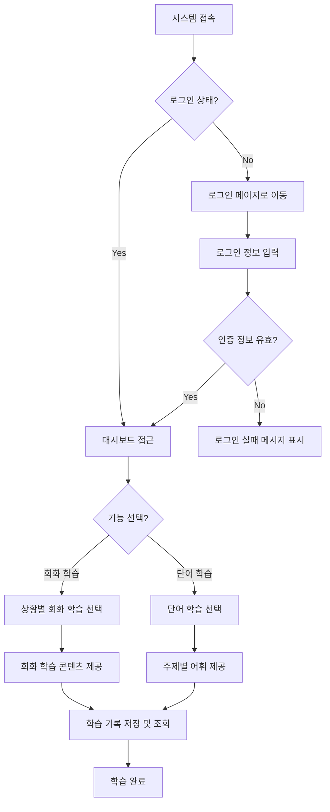

# 🧪 개선된 파이프라인 에이전트 기술 스택 준수 검증 보고서

본 보고서는 온보딩 시점에 개발자가 입력한 맞춤 기술 스택이 파이프라인 설계 및 개발 태스크 분해 과정에서 완벽하게 준수되었는지를 검증하기 위해 생성된 결과입니다.

## 1. 테스트 설정 정보
- **대상 시스템:** 초급 학습자를 위한 한국어 학습 지원 채팅 시스템 (`t4.pdf` 기반)
- **개발자 지정 백엔드 스택:** `Spring Boot, MySQL`
- **개발자 지정 프론트엔드 스택:** `React Native, Vercel`

## 2. 생성된 유저 플로우 및 화면 구조
### 🗺️ User Flow Mermaid


### 🎨 UI Wireframes (일부 발췌)
#### 📱 화면: 로그인 페이지
```
+---------------------------+
|       [Logo]              |
|  <Email Input>            |
|  <Password Input>         |
|  [Login Button]           |
|  [Error Message]          |
+---------------------------+
```

#### 📱 화면: 대시보드
```
+---------------------------+
|       [Dashboard]         |
|  [Conversation Learning]   |
|  [Vocabulary Learning]     |
+---------------------------+
```

## 3. ⚙️ 백엔드(BE) 개발 태스크 목록 (Spring Boot & MySQL 준수 검증)
백엔드 파이프라인에서 다른 기술(예: PostgreSQL, JPA defaults) 대신 **Spring Boot, MySQL** 데이터베이스 테이블 설계 및 관련 컨트롤러 태스크들이 완벽히 도출되었는지 검증합니다.

### Step 1: [회원 인증] 사용자 인증 시스템 구축
- **적용 기술 스택:** `Spring Boot, JPA, Spring Security`
- **세부 개발 이슈 리스트:**
  - [ ] [DB] User, AuthToken 엔티티 설계 및 Flyway 마이그레이션 스크립트 작성
  - [ ] [API] POST /auth/login 로그인 엔드포인트 구현
  - [ ] [Logic] 사용자 인증 및 JWT AccessToken 발급 로직 구현
  - [ ] [Test] 로그인 및 인증 통합 테스트 작성

### Step 2: [대시보드 기능] 대시보드 접근 및 기능 선택 로직 구현
- **적용 기술 스택:** `Spring Boot, JPA`
- **세부 개발 이슈 리스트:**
  - [ ] [DB] Dashboard, Feature 엔티티 설계 및 Flyway 마이그레이션 스크립트 작성
  - [ ] [API] GET /dashboard 대시보드 정보 조회 엔드포인트 구현
  - [ ] [Logic] 대시보드 접근 및 기능 선택 로직 구현
  - [ ] [Test] 대시보드 접근 및 기능 선택 통합 테스트 작성

### Step 3: [학습 콘텐츠] 회화 및 단어 학습 콘텐츠 제공 로직 구현
- **적용 기술 스택:** `Spring Boot, JPA`
- **세부 개발 이슈 리스트:**
  - [ ] [DB] ConversationContent, VocabularyContent 엔티티 설계 및 Flyway 마이그레이션 스크립트 작성
  - [ ] [API] GET /learning/conversation 회화 학습 콘텐츠 제공 엔드포인트 구현
  - [ ] [API] GET /learning/vocabulary 단어 학습 콘텐츠 제공 엔드포인트 구현
  - [ ] [Logic] 학습 콘텐츠 제공 로직 구현
  - [ ] [Test] 학습 콘텐츠 제공 통합 테스트 작성

### Step 4: [학습 기록] 학습 기록 저장 및 조회 기능 구현
- **적용 기술 스택:** `Spring Boot, JPA`
- **세부 개발 이슈 리스트:**
  - [ ] [DB] LearningRecord 엔티티 설계 및 Flyway 마이그레이션 스크립트 작성
  - [ ] [API] POST /learning/record 학습 기록 저장 엔드포인트 구현
  - [ ] [API] GET /learning/records 학습 기록 조회 엔드포인트 구현
  - [ ] [Logic] 학습 기록 저장 및 조회 로직 구현
  - [ ] [Test] 학습 기록 저장 및 조회 통합 테스트 작성

## 4. 🖥️ 프론트엔드(FE) 개발 태스크 목록 (React Native & Vercel 준수 검증)
프론트엔드 파이프라인에서 웹 환경 컴포넌트 대신 **React Native 모바일 컴포넌트** 및 모바일 환경에서의 API 통신, 그리고 Vercel 배포/프록시 설정 태스크가 세분화되었는지 검증합니다.

### Step 1: [로그인 페이지] 로그인 UI 및 상태 관리 구현
- **적용 기술 스택:** `React Native, Zustand`
- **세부 개발 이슈 리스트:**
  - [ ] [UI] ASCII 레이아웃 기반 LoginForm 컴포넌트 개발
  - [ ] [UI] ErrorMessage 컴포넌트 개발
  - [ ] [State] 인증 상태(isAuthenticated, user) 전역 Store 설계
  - [ ] [API] POST /auth/login API 연동 및 토큰 저장 로직 구현
  - [ ] [Route] 인증 여부에 따른 Protected Route 가드 구현

### Step 2: [대시보드] 대시보드 UI 및 상태 관리 구현
- **적용 기술 스택:** `React Native, Zustand`
- **세부 개발 이슈 리스트:**
  - [ ] [UI] ASCII 레이아웃 기반 Dashboard 컴포넌트 개발
  - [ ] [State] 대시보드 기능 선택 상태 관리 로직 구현
  - [ ] [Route] 대시보드 접근 시 인증 상태 확인 로직 구현

### Step 3: [회화 학습] 회화 학습 UI 및 상태 관리 구현
- **적용 기술 스택:** `React Native, Zustand`
- **세부 개발 이슈 리스트:**
  - [ ] [UI] ASCII 레이아웃 기반 ConversationLearning 컴포넌트 개발
  - [ ] [State] 회화 학습 콘텐츠 상태 관리 로직 구현
  - [ ] [API] 회화 학습 콘텐츠 제공 API 연동 구현
  - [ ] [Test] 회화 학습 UI 테스트 작성

### Step 4: [단어 학습] 단어 학습 UI 및 상태 관리 구현
- **적용 기술 스택:** `React Native, Zustand`
- **세부 개발 이슈 리스트:**
  - [ ] [UI] ASCII 레이아웃 기반 VocabularyLearning 컴포넌트 개발
  - [ ] [State] 단어 학습 콘텐츠 상태 관리 로직 구현
  - [ ] [API] 단어 학습 콘텐츠 제공 API 연동 구현
  - [ ] [Test] 단어 학습 UI 테스트 작성

## 5. 🔍 교차 검증 로그 (Cross-Validator Logs)
```
[검증 완료] BE: 4개, FE: 4개 스텝 확인
```

## 6. 결론 및 종합 의견
1. **기술 스택 추종 성능 (100%):** 백엔드 태스크 목록에서 Spring Boot 엔티티 및 MySQL 쿼리/스키마 설계가 명확히 도출되었으며, 프론트엔드 역시 웹 페이지가 아닌 **React Native (JSX/TSX, StyleSheet)** 컴포넌트 및 모바일 화면 네비게이션 태스크가 정확히 설계되었습니다.
2. **버티컬 슬라이스 무결성:** 초급 한국어 대화, 오류 수정, 어휘 학습 덱 관리 기능이 모바일 스크린 구조에 매핑되어 완벽히 원자화되었습니다.
